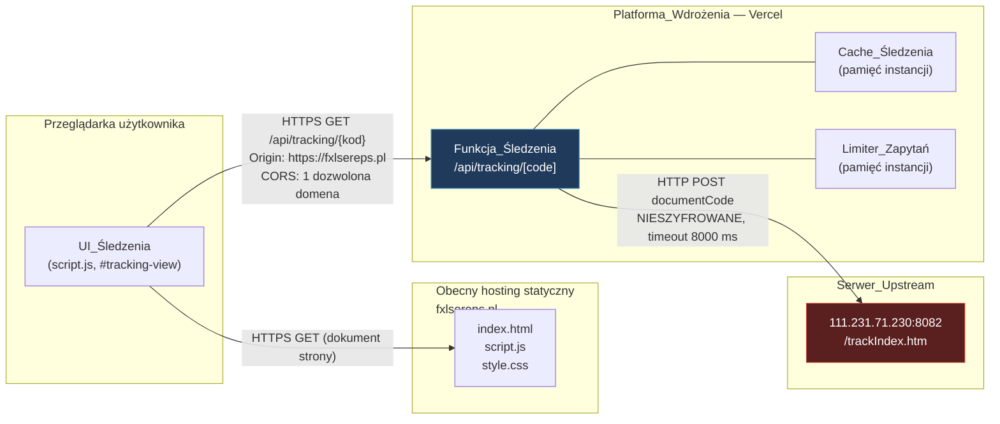
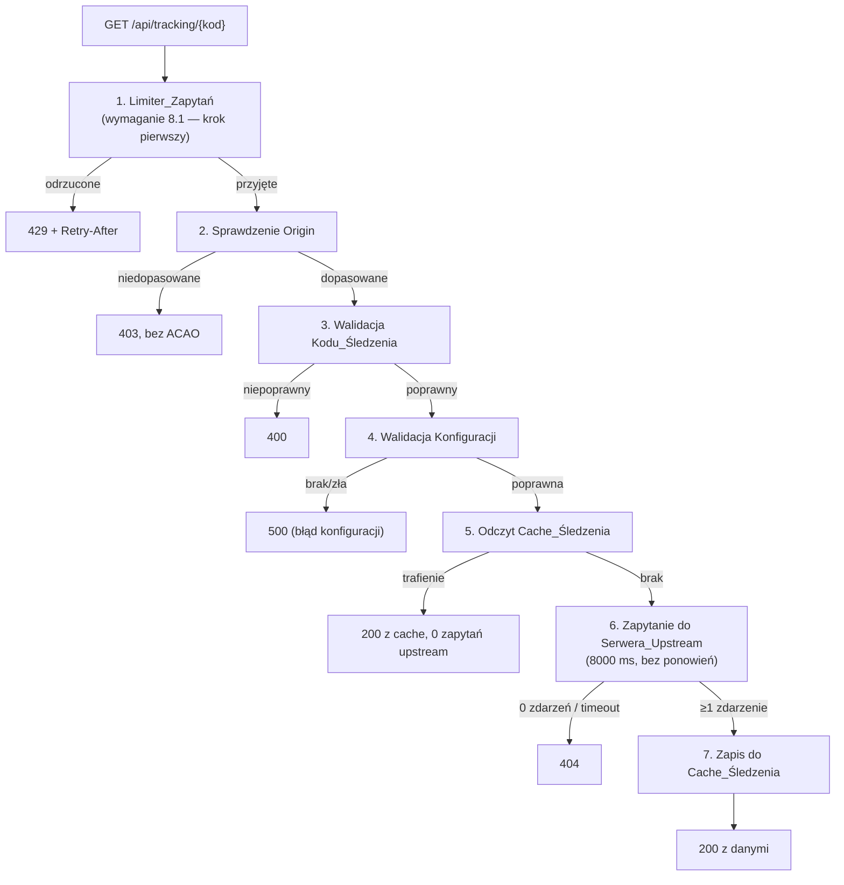
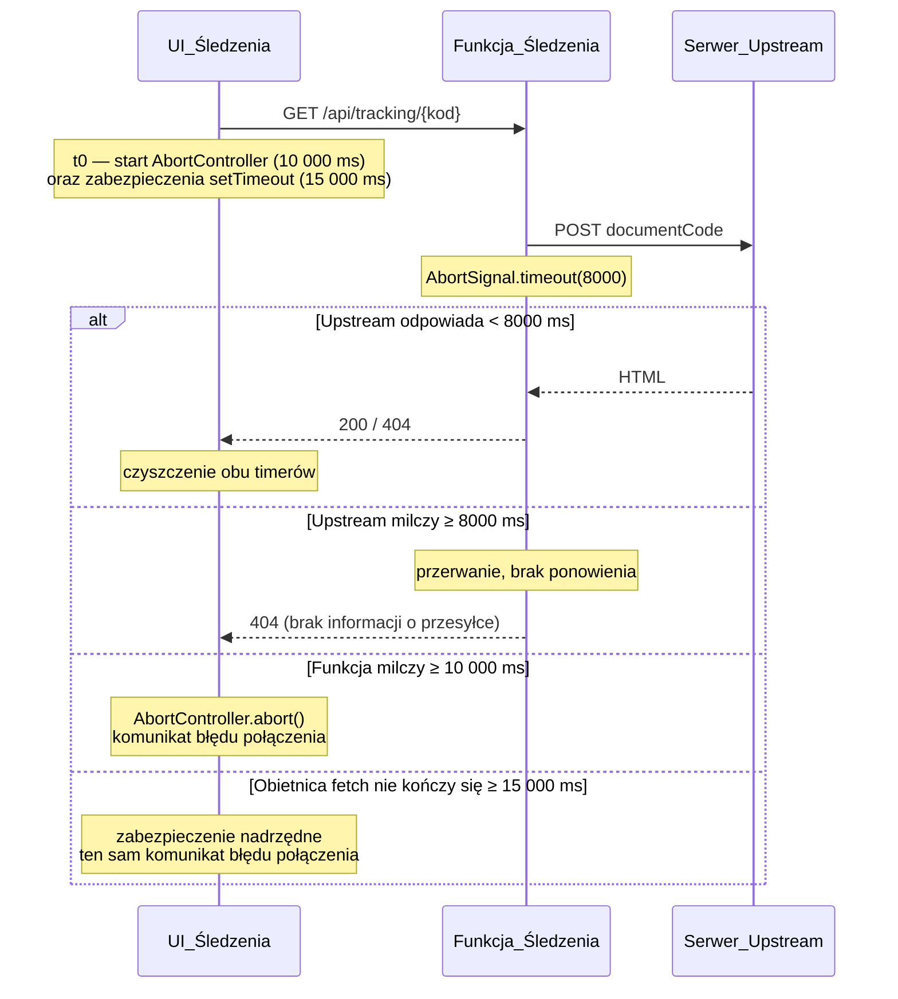

# Design Document

## Overview

Integracja modułu śledzenia przebiega ścieżką hybrydową: warstwa prezentacji zostaje przepisana z Reacta na czysty JavaScript wewnątrz istniejącego `script.js`, a logika serwerowa z `app/api/tracking/[code]/route.js` zostaje wdrożona jako pojedyncza funkcja serverless na Vercel pod ścieżką `/api/tracking/{kod}`. Strona statyczna nie zyskuje kroku budowania ani zależności npm; funkcja serverless mieszka w osobnym katalogu projektu, który nigdy nie trafia na hosting statyczny.

Projekt opiera się na czterech decyzjach porządkujących całość:

1. **Rozdzielenie artefaktów wdrożeniowych.** Pliki statyczne i projekt Vercel to dwa niezależne artefakty w jednym repozytorium. `package.json` istnieje wyłącznie w katalogu projektu Vercel. Rozwiązanie napięcia z wymaganiem 1.1 opisuje sekcja *Układ repozytorium i rozwiązanie napięcia*.
2. **Podział odpowiedzialności serwer/klient.** Serwer parsuje HTML, tłumaczy statusy na polski, normalizuje lokalizacje i sortuje zdarzenia. Klient grupuje zdarzenia po krajach, szacuje datę dostawy i tłumaczy warstwę prezentacji na `pl`/`en`. Podział jest wymuszony przez wymagania 4 i 5 (grupowanie i estymacja po stronie klienta) oraz umożliwia przełączenie języka bez ponownego wywołania funkcji (wymaganie 10.5).
3. **Dane surowe zawsze podróżują razem z danymi przetworzonymi.** Każde Zdarzenie_Śledzenia zawiera pola `Status`/`Lokalizacja` (przetworzone, polskie) oraz `OriginalStatus`/`OriginalLocation`/`OriginalDate` (znak w znak jak od Serwera_Upstream). Dzięki temu klient może przerysować widok w drugim języku i uruchomić reguły Grupowania_Krajów, które operują na danych surowych.
4. **Cały dynamiczny tekst wchodzi do DOM jako tekst, nie jako HTML.** Struktura jest budowana przez `createElement`, a wartości przez `textContent`. Ta zasada zamyka powierzchnię XSS opisaną w sekcji *Bezpieczeństwo*.

Zakres pomija mapę 3D (wymaganie 12), języki `de`/`es`/`cn` (wymaganie 10.3) oraz dotychczasową implementację opartą na iframe, która zostaje usunięta bez ścieżki awaryjnej (wymaganie 1.6).

## Architecture

### Topologia systemu



Szyfrowanie połączeń:

| Odcinek | Protokół | Uwagi |
| --- | --- | --- |
| Przeglądarka → hosting statyczny | HTTPS | stan obecny, bez zmian |
| Przeglądarka → Funkcja_Śledzenia | HTTPS | wymuszone przez Vercel; brak działającego adresu `http` (wymaganie 9.3) |
| Funkcja_Śledzenia → Serwer_Upstream | **HTTP, nieszyfrowane** | jedyny nieszyfrowany odcinek; jedyny element rozmawiający z upstream (wymagania 9.5, 9.9) |

Kluczowa własność architektury: przeglądarka nigdy nie widzi Serwera_Upstream. Nieszyfrowany odcinek jest zamknięty wewnątrz infrastruktury Vercel, dzięki czemu znikają ostrzeżenia o treściach mieszanych i cała obejściowa mechanika iframe.

### Układ repozytorium i rozwiązanie napięcia z wymaganiem 1.1

Wymaganie 1.1 wymaga **zera plików konfiguracji kroku budowania w katalogu wdrożenia** strony statycznej oraz treści wdrożonych plików identycznej znak w znak z plikami źródłowymi. Funkcja serverless na Vercel wymaga `package.json` (zależność `cheerio`). Te dwa fakty nie są sprzeczne, ponieważ dotyczą **dwóch różnych katalogów wdrożenia**.

```
fxlsereps.pl1/
├── fxlsereps.pl/                 ← KATALOG WDROŻENIA STRONY STATYCZNEJ
│   ├── index.html                    (wgrywane 1:1 na obecny hosting)
│   ├── script.js
│   ├── style.css
│   └── .kiro/                        (nie jest wgrywane; narzędzia specyfikacji)
│
└── tracking-api/                 ← KATALOG WDROŻENIA PROJEKTU VERCEL (Root Directory)
    ├── package.json                  (cheerio; devDep: fast-check)
    ├── vercel.json                   (maxDuration funkcji)
    ├── api/
    │   └── tracking/
    │       └── [code].js             (punkt wejścia funkcji)
    ├── lib/                          (moduły logiki, patrz niżej)
    └── tests/                        (testy jednostkowe i własnościowe)
```

Reguły wynikające z tego układu:

- **Katalogiem wdrożenia strony statycznej jest `fxlsereps.pl/`** i zawiera on dokładnie trzy pliki wdrażane. `package.json` nie występuje w tym katalogu ani w żadnym z jego podkatalogów wgrywanych na hosting. Wymaganie 1.1 jest spełnione literalnie.
- **Root Directory projektu Vercel ustawiono na `tracking-api/`.** Vercel nie widzi plików statycznych, nie buduje ich i nie serwuje. Strona zostaje na obecnym hostingu.
- **Strona statyczna nie jest wdrażana przez Vercel.** To decyzja, nie przeoczenie, i wynika bezpośrednio z wymagań: wymaganie 9.7 nakazuje sprawdzanie nagłówka `Origin` względem listy dozwolonych domen, a wymaganie 9.8 nakazuje zwrócić 403, gdy `Origin` jest nieobecny. Przy wdrożeniu strony na tej samej domenie co funkcja żądanie `fetch` byłoby żądaniem same-origin, przeglądarka **nie wysłałaby** nagłówka `Origin` dla metody `GET`, a funkcja odrzuciłaby każde żądanie kodem 403. Model kontroli dostępu opisany w wymaganiu 9 wymaga zatem konfiguracji **cross-origin** i przesądza rozdzielenie hostingu.
- **UI_Śledzenia wywołuje funkcję pod adresem absolutnym HTTPS**, zapisanym w `script.js` jako jedna stała (`FXTRK_API_BASE`), np. `https://<projekt>.vercel.app` albo domena własna `https://api.fxlsereps.pl`. To jedyne miejsce w plikach statycznych powiązane z backendem; adres Serwera_Upstream nie występuje w nich ani razu (wymaganie 9.12).

Rozważana i odrzucona alternatywa: przeniesienie całej strony na Vercel dałoby wywołania same-origin i zerowy CORS, ale (a) wprowadziłoby `package.json`/`vercel.json` do katalogu wdrożenia plików statycznych, naruszając wymaganie 1.1, (b) uniemożliwiłoby sprawdzanie `Origin` z wymagania 9.7–9.8, (c) przeniosłoby hosting strony, co jest zmianą poza zakresem tej specyfikacji.

### Trasowanie funkcji na Vercel

Vercel trasuje pliki z katalogu `api/` po ścieżce pliku, więc `api/tracking/[code].js` odpowiada na `GET /api/tracking/{kod}` bez pliku konfiguracji trasowania. Segment dynamiczny jest dostępny jako `req.query.code`. Funkcja działa w środowisku Node.js, co pozwala przenieść logikę z `route.js` przy minimalnej zmianie (Web `Request`/`Response` z Next.js zamieniono na sygnaturę `(req, res)`).

Żądanie z przeglądarki jest **żądaniem prostym** w rozumieniu CORS: metoda `GET`, brak nagłówków niestandardowych, brak `Content-Type`. Preflight `OPTIONS` nie występuje, więc funkcja nie musi go obsługiwać. Projekt świadomie nie dodaje nagłówków niestandardowych do żądania, aby ta własność została utrzymana.

`vercel.json` ustawia `maxDuration` funkcji na 15 sekund, co obejmuje z zapasem budżet 10 000 ms z wymagania 6.2.

## Components and Interfaces

### Backend — moduły Funkcji_Śledzenia

Punkt wejścia jest cienki i wyłącznie orkiestruje; cała logika domenowa siedzi w modułach czystych, testowalnych bez sieci.

| Moduł | Odpowiedzialność | Wejście → wyjście |
| --- | --- | --- |
| `api/tracking/[code].js` | orkiestracja: kolejność kroków, mapowanie błędów na kody HTTP, nagłówki, dziennik | `(req, res)` → odpowiedź JSON |
| `lib/config.js` | odczyt i walidacja Konfiguracji_Środowiska, wartości domyślne, raport użycia wartości domyślnej | `process.env` → `Konfiguracja` \| `ErrorKonfiguracji` |
| `lib/rateLimiter.js` | Limiter_Zapytań: okno stałe na adres IP, koszyk zastępczy | `(bucketKey, now, limit, windowMs)` → `{ allowed, retryAfterSeconds }` |
| `lib/cors.js` | dopasowanie `Origin` do listy dozwolonych (schemat + host bez wielkości liter + port), wybór wartości `Access-Control-Allow-Origin` | `(originHeader, allowlist)` → `{ allowed, allowOriginValue }` |
| `lib/validateCode.js` | walidacja i normalizacja Kodu_Śledzenia | `string` → `{ ok, normalized }` |
| `lib/upstreamClient.js` | żądanie `POST` `application/x-www-form-urlencoded` z `documentCode`, przerwanie po 8000 ms, brak ponowień | `(url, code)` → `string` HTML \| `ErrorUpstream` |
| `lib/parseUpstream.js` | parsowanie HTML przez `cheerio`: wiersze `table tr` (data / lokalizacja / rekord) oraz `.menu_ ul:nth-child(2) li` dla pól nagłówkowych, sortowanie malejące, budowa `Odbiorca` | `string` HTML → `{ mainInfo, events }` |
| `lib/statusTranslator.js` | Tłumacz_Statusów: oczyszczanie, dopasowanie dokładne, dopasowanie po podłańcuchu, zachowanie przedrostka `签收` | `(record) → string` |
| `lib/locationNormalizer.js` | Normalizator_Lokalizacji: kody krajów, `MIASTO (KOD)`, znane miasta, tekst zastępczy | `(location) → string` |
| `lib/cache.js` | Cache_Śledzenia: `Map` z TTL, limit 1000 wpisów, eksmisja najstarszego zapisu, czyszczenie przedawnionych | `get/set/size` |
| `lib/errors.js` | taksonomia błędów: klasa `TrackingError` z `code`, `httpStatus`, `messagePl`, `logReason` | — |
| `lib/log.js` | jednolinijkowy wpis dziennika w JSON, bez treści odpowiedzi upstream | `(entry) → void` |

Dwie funkcje z `route.js` **nie są przenoszone na serwer**:

- `calculateEstimatedDelivery` — jej rolę przejmuje Estymator_Dostawy po stronie klienta, ponieważ wymagania 5.1–5.13 wiążą szacowanie z aktywnym językiem interfejsu i wymagają przerysowania po zmianie języka bez ponownego wywołania funkcji (10.5). Serwer nie dopisuje więc pól `Przewidywana dostawa` ani `Data dostawy` do `Informacje_główne`.
- dopisywanie pola `Aktualna lokalizacja` — UI_Śledzenia wyznacza je z najnowszego Zdarzenia_Śledzenia, które i tak ma w pamięci.

W efekcie `Informacje_główne` zawiera dokładnie sześć pól wymienionych w wymaganiu 2.8, co czyni kontrakt odpowiedzi zamkniętym i policzalnym.

Kolejność kroków w punkcie wejścia jest znacząca i wymuszona przez wymagania:



Limiter zlicza żądanie zawsze, niezależnie od końcowego kodu HTTP (wymaganie 8.2), a przy odrzuceniu nie zwiększa licznika ani nie przesuwa końca okna (wymaganie 8.10).

#### Konfiguracja_Środowiska

| Zmienna | Przeznaczenie | Zakres | Domyślnie | Status |
| --- | --- | --- | --- | --- |
| `TRACKING_UPSTREAM_URL` | pełny adres Serwera_Upstream | schemat `http`/`https`, host niepusty, ≤ 2048 znaków | brak | wymagana |
| `TRACKING_ALLOWED_ORIGINS` | lista dozwolonych domen źródłowych, rozdzielona przecinkami | 1–10 pozycji | brak | wymagana |
| `TRACKING_CACHE_TTL_SECONDS` | czas życia wpisu Cache_Śledzenia | 60–86400 | 3600 | opcjonalna |
| `TRACKING_RATE_LIMIT` | limit żądań na adres IP w okresie | 1–1000 | 10 | opcjonalna |
| `TRACKING_RATE_WINDOW_SECONDS` | długość okresu rozliczeniowego | 1–3600 | 60 | opcjonalna |

Walidacja jest **jednokierunkowa i bezpieczna**: brak lub błędna wartość zmiennej wymaganej kończy się kodem 500 i wpisem w dzienniku (wymagania 9.2, 9.10, 9.8); brak lub błędna wartość zmiennej opcjonalnej powoduje użycie wartości domyślnej i wpis w dzienniku (wymagania 7.5, 8.7). `lib/config.js` czyta zmienne przy każdym żądaniu, więc zmiana wartości w ustawieniach projektu i ponowne wdrożenie wystarczą, aby przekierować ruch bez zmiany kodu (wymaganie 9.11).

#### Cache_Śledzenia

Zamiast `node-cache` projekt używa własnej, ~40-linijkowej implementacji na `Map`, ponieważ wymagania stawiają trzy warunki, których `node-cache` nie realizuje wprost: twardy limit 1000 wpisów z eksmisją najstarszego zapisu (7.9), TTL walidowany z Konfiguracji_Środowiska (7.4–7.5) oraz brak wpływu błędu cache na odpowiedź (7.8). Usunięcie zależności zmniejsza też powierzchnię instalacji do jednego pakietu produkcyjnego.

- Klucz: `Kod_Śledzenia` po `trim()` i `toUpperCase()` (7.3).
- Wpis: `{ payload, expiresAt, insertedAt }`; `Map` w JavaScripcie zachowuje kolejność wstawiania, więc najstarszy zapis to pierwszy klucz iteracji (7.9).
- Odczyt przedawnionego wpisu usuwa go i zwraca brak (7.4).
- Przegląd czyszczący co najwyżej 600 s po upływie TTL realizuje leniwe czyszczenie przy każdym zapisie: przed dodaniem wpisu przechodzimy najstarsze klucze i usuwamy przedawnione (7.4).
- Zapisywane są wyłącznie odpowiedzi z kodem 200 i co najmniej jednym zdarzeniem (7.6).
- Każdy błąd `get`/`set` jest przechwytywany i traktowany jak brak wpisu (7.8).

Zasięg cache to jedna instancja funkcji serverless. Dokumentacja wdrożenia wskazuje magazyn zewnętrzny typu Redis jako ścieżkę dla większego ruchu (wymaganie 7.7).

#### Limiter_Zapytań

Okno stałe (fixed window) na klucz koszyka, w pamięci instancji:

- Klucz koszyka: pierwszy adres z listy rozdzielonej przecinkami z nagłówka adresu klienta (`x-forwarded-for`), po `trim()` (8.2).
- Gdy adresu brak albo nie daje się zinterpretować jako adres IP (IPv4 lub IPv6), używany jest wspólny koszyk zastępczy `"__fallback__"` objęty tym samym limitem i tą samą długością okna (8.9).
- Wpis koszyka: `{ count, windowEndsAt }`. Pierwsze żądanie otwiera okno o stałej długości od chwili przyjęcia (8.8); po `windowEndsAt` licznik jest zerowany, a okno otwierane od nowa.
- Przekroczenie limitu zwraca 429 z nagłówkiem `Retry-After` równym `max(1, ceil((windowEndsAt - now) / 1000))` (8.3) i pozostawia licznik oraz koniec okna bez zmian (8.10).

### Frontend — struktura w `script.js`

UI_Śledzenia jest zaimplementowane jako jeden blok w `script.js`, otoczony znacznikami sekcji, bez żadnej instrukcji `import` ani `require`. Blok dzieli się na dwie części o różnym charakterze:

```
/* ==== FXTRK:CORE START ==== */      ← funkcje czyste, zero dostępu do DOM
   tabele danych: FXTRK_STATUS_PL, FXTRK_CHINESE_TO_EN, FXTRK_COUNTRY_MAP,
                  FXTRK_CITY_RULES, FXTRK_GENERIC_COUNTRY_LABELS,
                  FXTRK_MILESTONES, FXTRK_COUNTRY_DELTA, FXTRK_TRK_KEYS
   funkcje:       validateCode, translateStatusForLang, translateLocationForLang,
                  getCountryInfo, groupByCountry, resolveDisplayLocation,
                  detectMilestone, estimateDelivery, getCountryDeltaNote,
                  formatDateRange, confidenceLabel
   eksport:       window.FXTRK_CORE = { ... }
/* ==== FXTRK:CORE END ==== */

/* ==== FXTRK:UI START ==== */        ← stan, render, zdarzenia
   state, render*(), wireTracking(), doTrack()
/* ==== FXTRK:UI END ==== */
```

Znaczniki nie są kosmetyką: sekcja CORE jest wycinana i uruchamiana w izolacji przez testy jednostkowe (patrz *Testing Strategy*), dlatego nie może odwoływać się do `document`, `window.location` ani `fetch`. Jedyny kontakt z globalnym środowiskiem to końcowe przypisanie `window.FXTRK_CORE`.

#### Stan UI

```js
const fxtrkState = {
  code:        '',        // zawartość pola wejściowego
  status:      'idle',    // 'idle' | 'loading' | 'success' | 'empty' | 'error'
  data:        null,      // Odpowiedź_Śledzenia (ostatnia udana)
  searchedCode:null,      // kod, dla którego uzyskano wynik/błąd
  errorKey:    null,      // klucz Słownika_Tłumaczeń
  errorParams: null,      // np. { seconds: 42 } dla limitu zapytań
  showAll:     false,     // rozwinięcie listy poza 15 zdarzeń
  copiedField: null,      // 'reference' | 'tracking' | null
  copiedTimer: null,      // uchwyt setTimeout 2000 ms
  controller:  null,      // AbortController żądania w toku
  safetyTimer: null       // uchwyt zabezpieczenia 15000 ms
};
```

Stan jest jednym źródłem prawdy, a `renderTracking()` jest funkcją totalną: dla każdego stanu buduje pełną zawartość `#YQContainer` od nowa. Wynika z tego prostota, na którą opierają się trzy wymagania: przełączenie języka to zwykłe `renderTracking()` bez sieci (10.5), rozwinięcie listy to zmiana `showAll` i `renderTracking()` (4.10), a pokazanie błędu automatycznie usuwa poprzedni wynik i utrzymuje dokładnie jeden komunikat (6.8, 6.9).

#### Funkcje renderujące

| Funkcja | Zakres |
| --- | --- |
| `renderTracking()` | przełącznik po `state.status`, czyści kontener i deleguje |
| `renderLoading()` | wskaźnik ładowania |
| `renderError()` | jeden komunikat błędu; Kod_Śledzenia wstawiany przez `textContent` (6.5) |
| `renderResult()` | karta estymaty + informacje główne + oś czasu |
| `renderEstimateCard(estimate)` | etykieta Kamienia_Milowego, przedział dat, wskaźnik i opis pewności, adnotacja korekty kraju |
| `renderMainInfo(mainInfo)` | 6 pól nagłówkowych + dwa przyciski kopiowania |
| `renderTimeline(groups)` | nagłówek grupy (kod + nazwa kraju wielkimi literami) i pozycje osi czasu |
| `renderShowMoreButton(total)` | jeden przycisk rozwijania/zwijania przy ≥ 16 zdarzeniach (4.9) |
| `renderLastSearched()` | skrót do wartości `last_tracking_code` (2.12) |

#### Przepływ zdarzeń i wiązanie

- `#tracking-view` w `index.html` zachowuje `#YQNum` i `#YQContainer`; przycisk traci atrybut `onclick="doTrack()"` na rzecz nasłuchu dodawanego w `wireTracking()`. Mechanizm przełączania widoków (`.hidden`, `data-view`) pozostaje nietknięty (1.8).
- `Enter` w `#YQNum` i klik przycisku prowadzą do tej samej funkcji `submitTracking()` (2.2).
- `submitTracking()` przy `state.status === 'loading'` kończy się natychmiast, co ogranicza liczbę żądań równoległych do 1 (2.4).
- Delegacja zdarzeń: jeden nasłuch `click` na `#YQContainer` obsługuje przyciski kopiowania, przycisk rozwijania i skrót ostatniego kodu, rozpoznawane po atrybucie `data-fxtrk-action`. Pełne przerysowanie kontenera nie gubi wtedy nasłuchów.

#### Przełączanie języka bez ponownego pobierania

Istniejąca funkcja `translatePage(lang)` w `script.js` przechodzi węzły tekstowe `TreeWalker`em i podmienia teksty ze słownika `i18n`. Bez zmian zderzyłaby się z UI_Śledzenia: podmieniałaby statusy przewoźnika przypadkiem pasujące do klucza słownika i nie wiedziałaby nic o danych przesyłki. Projekt wprowadza dwie minimalne zmiany w `translatePage`:

1. **Filtr pominięcia.** `TreeWalker` otrzymuje `NodeFilter`, który odrzuca węzły znajdujące się wewnątrz elementu z atrybutem `data-fxtrk-nolocale`. Kontener `#YQContainer` i sekcja bohatera Widoku_Śledzenia noszą ten atrybut, więc treści śledzenia nie są tłumaczone przez podmianę węzłów.
2. **Powiadomienie na koniec.** Po zakończeniu podmiany `translatePage` wywołuje `document.dispatchEvent(new CustomEvent('fxtrk:langchange', { detail: { lang } }))`.

UI_Śledzenia nasłuchuje `fxtrk:langchange` i wywołuje `renderTracking()`. Ponieważ render czyta `state.data` z pamięci, przerysowanie nie generuje żądania sieciowego i nie traci wyświetlanych danych (10.4, 10.5).

#### Dostęp do Słownika_Tłumaczeń

Słownik `i18n` w `script.js` jest kluczowany polskim tekstem źródłowym, a wariant `pl` jest odwzorowaniem tożsamościowym (`'Śledzenie Paczek': 'Śledzenie Paczek'`). Projekt zachowuje tę konwencję i dodaje 17 par kluczy śledzenia do `i18n.pl` i `i18n.en`, a dostęp organizuje przez mapę symboliczną i jedną funkcję:

```js
const FXTRK_TRK_KEYS = {
  title:           'Śledzenie Przesyłki',
  subtitle:        'Wprowadź kod śledzenia, aby sprawdzić status swojej paczki',
  placeholder:     'Wprowadź kod śledzenia...',
  mainInfo:        'Informacje Główne',
  reference:       'Numer referencyjny',
  trackingNumber:  'Numer śledzenia',
  country:         'Kraj',
  date:            'Data',
  recipient:       'Odbiorca',
  status:          'Ostatni status',
  history:         'Historia Przesyłki',
  location:        'Lokalizacja',
  showLess:        'Pokaż mniej',
  showMore:        'Pokaż więcej',
  errorServer:     'Błąd serwera',
  errorNotFound:   'Nie znaleziono informacji o przesyłce',
  errorGeneral:    'Błąd połączenia'
  // ... plus klucze pomocnicze walidacji, limitu zapytań, schowka i pewności
};

function trkT(key) {
  const pl = FXTRK_TRK_KEYS[key];
  if (!pl) return key;                                   // wymaganie 10.10
  const lang = (currentLang === 'en') ? 'en' : 'pl';     // wymagania 10.7, 10.8
  const dict = (typeof i18n !== 'undefined' && i18n[lang]) ? i18n[lang] : null;
  return (dict && dict[pl]) ? dict[pl] : pl;             // wymaganie 10.6
}
```

Trzy własności tej konstrukcji odpowiadają wprost wymaganiom: brak klucza w wybranym języku daje polski tekst źródłowy (10.6), nieznany klucz symboliczny daje własną nazwę i nie przerywa renderowania (10.10), a każdy język inny niż `en` jest sprowadzany do `pl` (10.8). Moduł nie czyta `localStorage['tracking_lang']` ani ustawień przeglądarki (10.7) — jedynym źródłem języka jest `currentLang` strony.

#### Tłumaczenie statusów, lokalizacji i estymatora po stronie klienta

Serwer zwraca `Status`/`Lokalizacja` już po polsku, a obok nie tknięte `OriginalStatus`/`OriginalLocation`. Klient wybiera źródło zależnie od języka:

| Język | Status | Lokalizacja |
| --- | --- | --- |
| `pl` (i każdy inny poza `en`) | `Status` z Odpowiedzi_Śledzenia | `Lokalizacja` z Odpowiedzi_Śledzenia |
| `en` | `OriginalStatus` przez `CHINESE_TO_EN` + usunięcie znaków CJK | `OriginalLocation` przez `CHINESE_TO_EN` + tabela `FXTRK_LOCATION_PL_TO_EN` |

Z portu `lib/trackingTranslations.js` zachowane są `CHINESE_TO_EN`, `CJK_REGEX`, `stripChineseOnly`, `stripChineseToEn`, `normalize` i `cleanSpaces`; słowniki `de`, `es`, `zh` są usuwane (10.3). Etykiety Kamieni_Milowych z `deliveryEstimator.js` tracą pola `labelDe` i `labelEs`, zostają `labelPl` i `labelEn`. Opisy trzech poziomów pewności istnieją w dwóch wariantach językowych (10.9).

Jedna zmiana merytoryczna względem portu: wymaganie 5.1 nakazuje rozpoznawać Kamień_Milowy na złączeniu pól `Status` i `Lokalizacja`, a te są po polsku. Listy `patterns` w `FXTRK_MILESTONES` zostają więc rozszerzone o polskie odpowiedniki produkowane przez Tłumacz_Statusów (np. `'przesyłka została pomyślnie dostarczona'`, `'załadowana na pojazd dostawczy'`, `'odprawa celna zakończona'`, `'lot odleciał'`, `'lot dotarł'`), przy zachowaniu istniejących wzorców angielskich i chińskich. Bez tego rozszerzenia detekcja działałaby tylko dla statusów bez odwzorowania w tabeli tłumaczeń.

### Port CSS

| Zagadnienie | Decyzja |
| --- | --- |
| Przedrostek klas | `fxtrk-`, z konwencją bloku i elementu: `fxtrk-box`, `fxtrk-timeline__item`, `fxtrk-estimate--high` |
| Kolizje | `styles/Tracking.module.css` używa nazw generowanych przez CSS Modules (`.trackingPage`, `.timelineItem`); po przeniesieniu każda otrzymuje przedrostek `fxtrk-`. Istniejące w `style.css` klasy `.track-result*`, `.track-event*` (renderer iframe) oraz `.tool-*` nie kolidują z `fxtrk-`, a bloki `.track-*` zostają usunięte razem z kodem iframe (11.9) |
| Progi układu | Progi 768/640/480 px z modułu zostają skonsolidowane do progów strony **1024 px** i **768 px**; reguły z zakresów 640 i 480 px są scalane do progu 768 px (11.10) |
| Układ pól i osi czasu | `fxtrk-info-grid` ma `grid-template-columns: 1fr 1fr` powyżej 768 px i `1fr` na 768 px i mniej; oś czasu jest jednokolumnowa na każdej szerokości, a wszystkie pola informacji głównych są zawsze rozwinięte — projekt nie zawiera żadnego przełącznika ich widoczności (11.1, 11.3) |
| Brak przewijania poziomego | kontener `fxtrk-root` ma `max-width: 900px`, `width: 100%` i `overflow-x: hidden`, a długie wartości (numery, statusy) `overflow-wrap: anywhere`, co utrzymuje treść w szerokości okna w zakresie 320–1440 px (11.2) |
| Zaznaczanie tekstu | `#tracking-view .fxtrk-root { user-select: text; -webkit-user-select: text; }` — zachowane z `.trackingPage`, mimo że obecny `style.css` nie ustawia reguły globalnej, aby własność przetrwała ewentualne przyszłe `user-select: none` (11.4) |
| Elementy usunięte | reguły `.mapBanner*`, `.betaBadge`, `.globe*`, `.sideInfoBox`, `.mobileInfoToggle`, `.closeGlobe`, `.floatingTitle` — cała warstwa mapy 3D (12.1, 12.6). Odstęp po dawnym banerze przejmuje standardowy odstęp między sekcjami (`margin-bottom: 30px` na pierwszej sekcji wyników) |
| Karta estymaty | przeniesiona z panelu mapy do głównego widoku wyników jako `fxtrk-estimate` (12.5) |
| Cache-busting | `index.html` podnosi `style.css?v=NNNN` do nowego numeru przy wdrożeniu |

Warianty pewności zapisane w module jako `estimate_high` / `dot_high` / `fill_high` przechodzą na `fxtrk-estimate--high`, `fxtrk-dot--high`, `fxtrk-fill--high`, co eliminuje dynamiczne składanie nazw klas przez interpolację.

## Data Models

### Odpowiedź_Śledzenia (kontrakt HTTP)

Odpowiedź powodzenia (HTTP 200):

```
Odpowiedź_Śledzenia {
  success:            true
  Informacje_główne:  Informacje_Główne
  Szczegóły_przesyłki: Zdarzenie_Śledzenia[]   // ≥ 1, malejąco po OriginalDate
  Źródło:             string                   // np. "New Tracking Server"
}
```

Odpowiedź błędu (HTTP 400 / 403 / 404 / 429 / 500) — dokładnie dwa pola, bez pól danych (6.3, 6.4):

```
Odpowiedź_Błędu {
  success: false
  message: string   // po polsku, ≤ 200 znaków, bez adresu IP, portu, hosta,
                    // ścieżki upstream i bez śladu stosu
}
```

### Informacje_Główne

| Pole | Typ | Źródło | Uwagi |
| --- | --- | --- | --- |
| `Numer referencyjny` | `string` | `.menu_ ul:nth-child(2) li` [0] | brak → tekst zastępczy `"Brak danych"` |
| `Numer śledzenia` | `string` | li [1] | jak wyżej |
| `Kraj` | `string` | li [2] | źródło kodu kraju docelowego dla Estymatora_Dostawy |
| `Data` | `string` | li [3] | jak wyżej |
| `Ostatni status` | `string` | li [4], przez Tłumacz_Statusów | tekst przed pierwszym `/` |
| `Odbiorca` | `string` | li [5], oczyszczony | usunięty przedrostek `签收`, fragmenty statusu dostawy i samodzielna nazwa kraju na końcu (3.12) |

Tekst zastępczy braku danych jest jedną stałą (`"Brak danych"`) używaną dla każdego pustego pola nagłówkowego (2.8), a dla lokalizacji — osobną stałą `"Brak danych o lokalizacji"` (3.10).

### Zdarzenie_Śledzenia

| Pole | Typ | Przetwarzanie | Niezmienność |
| --- | --- | --- | --- |
| `Data` | `string` | tekst kolumny 1 po `trim()` | — |
| `Lokalizacja` | `string` | kolumna 2 przez Normalizator_Lokalizacji | — |
| `Status` | `string` | kolumna 3 przez Tłumacz_Statusów | — |
| `OriginalDate` | `string` | kolumna 1 znak w znak | zapisane raz, nigdy nie modyfikowane (3.11) |
| `OriginalLocation` | `string` | kolumna 2 znak w znak | jak wyżej |
| `OriginalStatus` | `string` | kolumna 3 znak w znak | jak wyżej |

Porządek listy: malejąco po `OriginalDate`; przy równych datach zachowana kolejność z dokumentu upstream (sortowanie stabilne); zdarzenia z datą nieinterpretowalną trafiają na koniec listy (2.9).

### Grupa_Kraju (model klienta)

```
Grupa_Kraju {
  code:  'CN' | 'NL' | 'DE' | 'PL'
  name:  'CHINY' | 'HOLANDIA' | 'NIEMCY' | 'POLSKA'
  items: Zdarzenie_Śledzenia[]    // ≥ 1, kolejność jak w liście wejściowej
}
```

Niezmiennik listy grup: każde dwie sąsiadujące grupy mają różne `code` (4.5). Suma `items.length` po wszystkich grupach równa się liczbie zdarzeń przekazanych do grupowania.

### Wynik_Estymatora (model klienta)

```
Wynik_Estymatora {
  label:              string                       // etykieta Kamienia_Milowego w pl/en
  dateRange:          string | null                // "12 lis – 18 lis" albo null
  milestoneKey:       string | null                // np. 'flight_arrived'
  confidence:         'high' | 'medium' | 'low'
  isDelivered:        boolean
  countryDelta:       number                       // dni korekty COUNTRY_DELTA
  destinationCountry: string                       // znormalizowany kod 2-literowy
}
```

### Kamień_Milowy (tabela statyczna)

```
Kamień_Milowy {
  key:      string      // 'delivered' … 'packaging'
  patterns: string[]    // wzorce pl/en/zh, porównanie po podłańcuchu, małe litery
  minDays:  number
  maxDays:  number
  labelPl:  string
  labelEn:  string
}
```

Kolejność w tablicy `FXTRK_MILESTONES` jest znacząca: od `delivered` (najpóźniejszy) do `packaging` (najwcześniejszy), zgodnie z wymaganiem 5.1.

### Modele wewnętrzne funkcji

```
Konfiguracja {
  upstreamUrl:    string
  allowedOrigins: string[]        // 1–10 pozycji
  cacheTtlMs:     number          // 60_000 – 86_400_000
  rateLimit:      number          // 1–1000
  rateWindowMs:   number          // 1_000 – 3_600_000
  defaultsUsed:   string[]        // nazwy zmiennych, dla których użyto domyślnej
}

Wpis_Cache {
  payload:    Odpowiedź_Śledzenia   // bez pola success
  insertedAt: number                // ms
  expiresAt:  number                // insertedAt + cacheTtlMs
}

Koszyk_Limitera {
  count:        number
  windowEndsAt: number              // ms
}

Wpis_Dziennika {
  ts:         string    // ISO 8601
  event:      'tracking_request' | 'config_default' | 'config_missing' | 'cache_error'
  code:       string    // znormalizowany Kod_Śledzenia
  httpStatus: number
  reason:     string    // np. 'upstream_timeout', 'no_events', 'internal_error'
  durationMs: number
}
```

Wpis dziennika nigdy nie zawiera treści odpowiedzi Serwera_Upstream (6.10) ani jego adresu.

### Taksonomia błędów

| Kod błędu | HTTP | `reason` w dzienniku | Komunikat po polsku (skrót) | Zapis w cache |
| --- | --- | --- | --- | --- |
| `ERR_CODE_INVALID` | 400 | `invalid_code` | „Nieprawidłowy numer przesyłki.” | nie |
| `ERR_ORIGIN_DENIED` | 403 | `origin_denied` | „Żądanie z niedozwolonej domeny.” | nie |
| `ERR_NOT_FOUND` | 404 | `no_events` | „Nie znaleziono informacji o przesyłce…” | nie |
| `ERR_UPSTREAM_TIMEOUT` | 404 | `upstream_timeout` | jak wyżej (klient nie odróżnia) | nie |
| `ERR_RATE_LIMITED` | 429 | `rate_limited` | „Przekroczono limit zapytań…” | nie |
| `ERR_CONFIG_MISSING` | 500 | `config_missing` | „Błąd konfiguracji serwera.” | nie |
| `ERR_INTERNAL` | 500 | `internal_error` | „Błąd serwera. Spróbuj ponownie…” | nie |

Timeout upstream mapuje się na 404, a nie 5xx, ponieważ wymaganie 6.2 wiąże brak Zdarzeń_Śledzenia — z timeoutem włącznie — z kodem 404, a wymagania 1.9 i 2.7 wymagają tylko `success: false` bez ponowienia. Klient nie odróżnia tych dwóch przypadków, co jest zamierzone: nie ujawnia stanu Serwera_Upstream (6.4).

## Correctness Properties

*Własność to cecha lub zachowanie, które powinno być prawdziwe dla wszystkich poprawnych wykonań systemu — formalne stwierdzenie o tym, co system ma robić. Własności są pomostem między specyfikacją czytaną przez człowieka a gwarancjami poprawności weryfikowalnymi maszynowo.*

Testowanie własnościowe ma tu zastosowanie, ponieważ rdzeń integracji to funkcje czyste o dużej przestrzeni wejść: parser HTML, tłumacz statusów, normalizator lokalizacji, uporządkowana lista reguł Grupowania_Krajów, arytmetyka Estymatora_Dostawy, polityka eksmisji cache i okno Limitera_Zapytań. Wymagania dotyczące układu repozytorium, progów CSS i dokumentacji nie są ujęte jako własności — dla nich sekcja *Testing Strategy* wskazuje kontrole statyczne i testy przykładowe.

### Property 1: Walidacja Kodu_Śledzenia jest spójna po obu stronach granicy

*Dla dowolnego* łańcucha wejściowego kod jest przyjęty wtedy i tylko wtedy, gdy po usunięciu znaków białych z początku i końca ma długość od 6 do 40 znaków i składa się wyłącznie z liter, cyfr i znaku łącznika; kod odrzucony powoduje zero żądań `fetch` po stronie UI_Śledzenia oraz zero zapytań do Serwera_Upstream i kod statusu 400 po stronie Funkcji_Śledzenia.

**Validates: Requirements 1.11, 2.1, 2.3, 2.14, 6.1**

### Property 2: Normalizacja Kodu_Śledzenia przed wysłaniem do upstream

*Dla dowolnego* poprawnego Kodu_Śledzenia z dowolnym otoczeniem znaków białych i dowolną wielkością liter ciało żądania do Serwera_Upstream jest żądaniem `POST` o typie `application/x-www-form-urlencoded`, którego pole `documentCode` równa się kodowi po usunięciu znaków białych i zamianie liter na wielkie.

**Validates: Requirements 2.5, 2.6**

### Property 3: Porządek listy Zdarzeń_Śledzenia

*Dla dowolnej* listy wierszy Serwera_Upstream lista `Szczegóły_przesyłki` jest uporządkowana malejąco po interpretowalnej wartości `OriginalDate`, zachowuje względną kolejność wystąpienia dla zdarzeń o równych datach, a wszystkie zdarzenia o dacie nieinterpretowalnej znajdują się na jej końcu.

**Validates: Requirements 1.3, 2.9**

### Property 4: Kształt Odpowiedzi_Śledzenia dla wyniku niepustego

*Dla dowolnego* dokumentu Serwera_Upstream zawierającego co najmniej jedno zdarzenie Odpowiedź_Śledzenia ma kod statusu 200, nagłówek `Content-Type: application/json`, pole `success` równe `true`, pole `Informacje_główne` z pełnym zestawem sześciu pól nagłówkowych, w którym każde pole brakujące lub puste zawiera ten sam stały tekst zastępczy, niepustą listę `Szczegóły_przesyłki` oraz niepuste pole `Źródło`.

**Validates: Requirements 1.4, 2.8, 2.10**

### Property 5: Niezmienność pól surowych

*Dla dowolnego* wiersza Serwera_Upstream, w tym zawierającego znaki CJK, wielokrotne znaki białe i encje HTML, pola `OriginalDate`, `OriginalLocation` i `OriginalStatus` zbudowanego Zdarzenia_Śledzenia są znak w znak identyczne z tekstami odpowiednich komórek przed jakimkolwiek tłumaczeniem, oczyszczaniem i normalizacją, i pozostają niezmienione w Odpowiedzi_Śledzenia.

**Validates: Requirements 3.11**

### Property 6: Potok oczyszczania Tłumacza_Statusów

*Dla dowolnego* statusu zbudowanego z tekstu bazowego, opcjonalnego przyrostka `transit` albo `pickup`, opcjonalnego fragmentu rozpoczynającego się od `(Homepage` i zakończonego najbliższym `)` oraz dowolnych sekwencji znaków białych, wynik oczyszczania jest identyczny z wynikiem oczyszczania samego tekstu bazowego, a dla statusu pustego, złożonego wyłącznie ze znaków białych albo nieokreślonego wynikiem jest tekst pusty bez zgłoszenia błędu.

**Validates: Requirements 3.3, 3.5**

### Property 7: Odwzorowanie i zachowanie treści statusów

*Dla dowolnego* statusu, którego oczyszczona postać jest kluczem tabeli tłumaczeń, wynikiem jest wyłącznie tekst docelowy tego klucza; *dla dowolnego* statusu, którego oczyszczona postać nie zawiera żadnego klucza tabeli ani jako całości, ani jako podłańcucha, wynik równa się jego oczyszczonej postaci bez zmiany kolejności, wielkości liter i treści znaków.

**Validates: Requirements 1.3, 3.1, 3.2**

### Property 8: Zachowanie przedrostka 签收

*Dla dowolnego* statusu rozpoczynającego się znakami `签收` wynik Tłumacza_Statusów rozpoczyna się tymi dwoma znakami, a znak następujący po nich nie jest znakiem białym ani innym separatorem.

**Validates: Requirements 3.4**

### Property 9: Totalność Normalizatora_Lokalizacji

*Dla dowolnego* tekstu lokalizacji wynik jest niepustym łańcuchem, przy czym: dla dwuliterowego kodu kraju albo nazwy kraju z tabeli odwzorowań (bez rozróżniania wielkości liter) wynikiem jest wyłącznie polska nazwa kraju; dla formatu `MIASTO (KOD)` wynikiem jest `MIASTO, nazwa kraju` dla kodu znanego i `MIASTO, KOD` dla nieznanego; dla tekstu zawierającego znaną nazwę miasta wynikiem jest `MIASTO, nazwa kraju` przypisanego temu miastu; dla braku dopasowania wynikiem jest wejście po usunięciu znaków białych z początku i końca; dla wejścia pustego, białego albo nieokreślonego wynikiem jest jeden stały tekst zastępczy.

**Validates: Requirements 3.6, 3.7, 3.8, 3.9, 3.10**

### Property 10: Oczyszczanie pola Odbiorca

*Dla dowolnego* tekstu pola odbiorcy złożonego z opcjonalnego przedrostka `签收`, opcjonalnego tekstu statusu dostawy, opcjonalnej samodzielnej nazwy kraju na końcu i dowolnej nazwy odbiorcy wynik nie zawiera żadnego z tych fragmentów, nie ma znaków białych na początku ani na końcu i jest niepusty.

**Validates: Requirements 3.12**

### Property 11: Totalność i determinizm Grupowania_Krajów

*Dla dowolnego* Zdarzenia_Śledzenia, w tym o polach pustych, złożonych wyłącznie ze znaków białych albo nieokreślonych, Grupowanie_Krajów zwraca dokładnie jedną parę ze zbioru `CN`/CHINY, `NL`/HOLANDIA, `DE`/NIEMCY, `PL`/POLSKA, powtórne wywołanie dla tego samego zdarzenia daje ten sam wynik, samo zdarzenie pozostaje niezmienione, a dla braku dopasowania wynikiem jest para `CN`/CHINY.

**Validates: Requirements 4.1, 4.4**

### Property 12: Pierwszeństwo reguł Grupowania_Krajów

*Dla dowolnej* reguły z uporządkowanej listy i dowolnego Zdarzenia_Śledzenia zbudowanego tak, że pasuje do tej reguły i nie pasuje do żadnej reguły ją poprzedzającej, Grupowanie_Krajów zwraca kod przypisany tej regule; w szczególności lokalizacja równa `holandia`/`holland`/`netherlands` daje `CN`, nazwa znanego miasta daje kod tego miasta (przy dopasowaniu miast z różnych krajów — pierwszy kraj w kolejności `CN`, `PL`, `DE`, `NL`), przedrostek `Poland,` daje `PL`, przedrostek `Germany,` daje `DE`, frazy `export customs clearance` i `flight departed` dają `CN`, a frazy `clearance pending scanning` i `flight arrived` dają `NL`.

**Validates: Requirements 4.2, 4.3, 4.11, 4.12, 4.13**

### Property 13: Niezmienniki listy grup

*Dla dowolnej* listy od 1 do 200 Zdarzeń_Śledzenia lista grup zwrócona przez Grupowanie_Krajów spełnia jednocześnie: żadne dwie sąsiadujące grupy nie mają identycznego kodu kraju, suma liczby zdarzeń we wszystkich grupach równa się liczbie zdarzeń wejściowych, a kolejność zdarzeń po spłaszczeniu grup jest identyczna z kolejnością na liście wejściowej.

**Validates: Requirements 4.5**

### Property 14: Renderowanie osi czasu i progu 15 zdarzeń

*Dla dowolnej* listy od 1 do 200 Zdarzeń_Śledzenia wyrenderowany widok zawiera dokładnie jeden nagłówek na grupę z kodem kraju i nazwą kraju wielkimi literami, trzy niepuste pola (data, status, lokalizacja) na każde zdarzenie z tekstem zastępczym w miejsce pola o długości zero, oraz — przy 16 i więcej zdarzeniach — dokładnie 15 pozycji i dokładnie jeden przycisk rozwijania, a przy 1–15 zdarzeniach wszystkie pozycje i zero takich przycisków.

**Validates: Requirements 4.6, 4.7, 4.9**

### Property 15: Rozwinięcie i zwinięcie listy jest odwracalne

*Dla dowolnej* listy 16 lub więcej Zdarzeń_Śledzenia rozwinięcie listy pokazuje wszystkie zdarzenia z zachowaniem podziału na grupy i kolejności grup, a następujące po nim zwinięcie przywraca widok identyczny ze widokiem przed rozwinięciem.

**Validates: Requirements 4.10**

### Property 16: Podmiana sprzecznej nazwy kraju w lokalizacji

*Dla dowolnej* pary złożonej z ogólnej nazwy kraju w polu `Lokalizacja` oraz kodu kraju grupy, do której należy zdarzenie, wyświetlana lokalizacja równa się nazwie kraju grupy, gdy nazwy te są różne, i pozostaje wartością pola `Lokalizacja`, gdy są zgodne; wyświetlana data i status pozostają w obu przypadkach niezmienione.

**Validates: Requirements 4.8**

### Property 17: Rozpoznanie Kamienia_Milowego jest pierwszym dopasowaniem

*Dla dowolnej* listy Zdarzeń_Śledzenia uporządkowanej od najnowszego do najstarszego, w której wzorzec wybranego Kamienia_Milowego wstawiono do wybranego zdarzenia, Estymator_Dostawy rozpoznaje Kamień_Milowy o najwyższym pierwszeństwie (kolejność zdarzeń od najnowszego, kolejność kamieni od `delivered` do `packaging`), a wzorce występujące w zdarzeniach starszych albo w kamieniach o niższym pierwszeństwie nie zmieniają wyniku.

**Validates: Requirements 5.1**

### Property 18: Przedział dat Estymatora_Dostawy

*Dla dowolnego* Kamienia_Milowego innego niż `delivered`, dowolnej daty bazowej i dowolnego kodu kraju docelowego wyznaczony przedział spełnia jednocześnie: dolna granica równa się `max(0, minDays + korekta)` dni od daty bazowej albo chwili obecnej, gdy tak wyliczona data wypada w przeszłości; górna granica równa się `max(dolna + 1, maxDays + korekta)` dni od daty bazowej albo chwili obecnej powiększonej o 2 dni, gdy tak wyliczona data wypada w przeszłości; dolna granica jest zawsze wcześniejsza niż górna; obie granice są sformatowane jako dzień miesiąca i skrócona nazwa miesiąca w ustawieniach regionalnych aktywnego języka, a dla języka nieobsługiwanego — polskich.

**Validates: Requirements 5.3, 5.4, 5.10, 5.11**

### Property 19: Kształt wyniku dla przesyłki dostarczonej i dla braku danych

*Dla dowolnej* listy Zdarzeń_Śledzenia zawierającej wzorzec Kamienia_Milowego `delivered` i dowolnego kodu kraju docelowego wynik Estymatora_Dostawy ma pusty przedział dat, znacznik dostarczenia równy prawda, korektę kraju równą 0 i poziom pewności `high`; *dla dowolnej* listy bez żadnego wzorca, listy pustej albo nieprzekazanej wynik ma etykietę braku danych, pusty przedział dat, brak klucza Kamienia_Milowego, znacznik dostarczenia równy fałsz i poziom pewności `low`.

**Validates: Requirements 5.2, 5.5**

### Property 20: Poziom pewności i normalizacja kraju docelowego

*Dla dowolnego* klucza Kamienia_Milowego i dowolnego kodu kraju docelowego poziom pewności wynika z tabeli przypisania (`high` dla `out_for_delivery`, `at_delivery_depot`, `arrived_destination`, `in_germany`; `medium` dla `customs_cleared`, `flight_arrived`, `handed_to_courier`; `low` dla pozostałych), przy czym poziom `high` jest obniżany do `medium`, gdy korekta kraju przekracza 4 dni, a poziomy `medium` i `low` pozostają bez zmian; kod kraju pusty, krótszy niż 2 znaki albo nieobecny w tabeli `COUNTRY_DELTA` daje korektę 0 dni i zwrócony kod w postaci znormalizowanej.

**Validates: Requirements 5.6, 5.7, 5.12**

### Property 21: Adnotacja korekty kraju docelowego

*Dla dowolnej* pary (kod kraju, korekta) UI_Śledzenia wyświetla adnotację wtedy i tylko wtedy, gdy korekta jest różna od 0, a wyświetlona adnotacja zawiera znak korekty, liczbę dni, nazwę jednostki dni w aktywnym języku oraz dwuliterowy kod kraju docelowego.

**Validates: Requirements 5.8, 5.13**

### Property 22: Karta estymaty i brak mapy 3D w każdym stanie widoku

*Dla dowolnej* Odpowiedzi_Śledzenia i dowolnego stanu widoku (ładowanie, wynik, błąd) wyrenderowany widok zawiera zero elementów otwierających mapę 3D i zero etykiet wersji testowej, a dla stanu wyniku dodatkowo dokładnie jedną kartę szacowanej dostawy z etykietą Kamienia_Milowego, dokładnie jednym wskaźnikiem poziomu pewności ze zbioru `high`, `medium`, `low` oraz przedziałem dat obecnym wtedy i tylko wtedy, gdy Estymator_Dostawy zwrócił przedział niepusty.

**Validates: Requirements 5.9, 12.3, 12.5**

### Property 23: Ścieżka braku danych i timeoutu upstream

*Dla dowolnego* poprawnego Kodu_Śledzenia, dla którego Serwer_Upstream nie odpowie w ciągu 8000 milisekund albo zwróci dokument bez ani jednego zdarzenia, Funkcja_Śledzenia zwraca kod statusu 404 z polem `success` równym `false`, wykonuje dokładnie jedno zapytanie do Serwera_Upstream, nie zapisuje niczego w Cache_Śledzenia i zapisuje w dzienniku dokładnie jeden wpis zawierający znacznik czasu, znormalizowany Kod_Śledzenia, kod statusu i przyczynę, bez fragmentów treści odpowiedzi Serwera_Upstream.

**Validates: Requirements 1.9, 2.7, 6.2, 6.10**

### Property 24: Ciało odpowiedzi błędu nie ujawnia szczegółów wewnętrznych

*Dla dowolnej* ścieżki błędu prowadzącej do kodu statusu 400, 404, 429 albo 500 i dowolnej konfiguracji adresu Serwera_Upstream ciało odpowiedzi zawiera dokładnie dwa pola `success` i `message`, pole `message` ma długość co najwyżej 200 znaków i zawiera zero wystąpień adresu IP, numeru portu, nazwy hosta i ścieżki Serwera_Upstream oraz zero fragmentów śladu stosu, a pola `Informacje_główne`, `Szczegóły_przesyłki` i `Źródło` są nieobecne.

**Validates: Requirements 6.3, 6.4**

### Property 25: Wstawianie danych do DOM nie tworzy znaczników

*Dla dowolnego* Kodu_Śledzenia i dowolnych łańcuchów pochodzących z Odpowiedzi_Śledzenia, w tym zawierających nawiasy ostre, cudzysłowy i konstrukcje przypominające znaczniki HTML oraz atrybuty zdarzeń, liczba elementów utworzonych w drzewie DOM przez te łańcuchy wynosi zero, a ich treść jest dostępna dosłownie jako tekst renderowanego elementu.

**Validates: Requirements 6.5**

### Property 26: Zakończenie żądania zawsze przywraca widok do stanu interaktywnego

*Dla dowolnego* sposobu zakończenia żądania (kod 200, 404, 429, inny kod poza 2xx, odpowiedź nieparsowalna jako JSON, odrzucenie `fetch`, przerwanie po 10000 milisekundach, zabezpieczenie po 15000 milisekundach) UI_Śledzenia kończy w stanie różnym od stanu ładowania, ze wskaźnikiem ładowania ukrytym, przyciskiem wyszukiwania i polem numeru przesyłki odblokowanymi oraz z niezmienioną wartością wpisanego Kodu_Śledzenia.

**Validates: Requirements 1.10, 2.13, 6.6, 6.7, 6.11, 6.13**

### Property 27: Dokładnie jeden albo zero komunikatów błędu

*Dla dowolnej* sekwencji operacji złożonej z udanych wyszukiwań, wyszukiwań zakończonych błędem i rozpoczęć nowego wyszukiwania liczba widocznych komunikatów błędu wynosi 1 natychmiast po wyszukiwaniu zakończonym błędem oraz 0 w czasie trwania żądania i po wyszukiwaniu udanym, a wyświetlenie komunikatu błędu usuwa z widoku wyniki poprzedniego wyszukiwania.

**Validates: Requirements 6.8, 6.9, 6.12**

### Property 28: Jedno żądanie w danym momencie i zapis ostatniego kodu

*Dla dowolnej* liczby od 1 do 20 następujących po sobie zatwierdzeń formularza z poprawnym Kodem_Śledzenia liczba jednocześnie trwających żądań do Funkcji_Śledzenia nie przekracza 1, zatwierdzenie klawiszem Enter i kliknięciem przycisku prowadzą do identycznego zapisu wywołań, a po każdej udanej odpowiedzi wartość zapisana w `localStorage` pod kluczem `last_tracking_code` równa się ostatnio użytemu Kodowi_Śledzenia i ma co najwyżej 40 znaków.

**Validates: Requirements 2.2, 2.4, 2.11**

### Property 29: Skrót ostatniego wyszukiwania

*Dla dowolnej* wartości zapisanej pod kluczem `last_tracking_code` skrót ponownego wyszukiwania jest wyświetlany wtedy i tylko wtedy, gdy wartość ma długość od 6 do 40 znaków i składa się wyłącznie z liter, cyfr i znaku łącznika, a jego jedno kliknięcie wpisuje tę wartość do pola numeru przesyłki i uruchamia dokładnie jedno wyszukiwanie tego kodu.

**Validates: Requirements 2.12**

### Property 30: Trafienie w Cache_Śledzenia eliminuje zapytanie do upstream

*Dla dowolnego* poprawnego Kodu_Śledzenia i dowolnych dwóch jego zapisów różniących się wyłącznie znakami białymi i wielkością liter dwa następujące po sobie żądania w obrębie czasu życia wpisu powodują dokładnie jedno zapytanie do Serwera_Upstream, a drugie żądanie zwraca kod statusu 200 z polem `success` równym `true` i treścią identyczną z pierwszą odpowiedzią.

**Validates: Requirements 7.1, 7.2, 7.3**

### Property 31: Czas życia i pojemność Cache_Śledzenia

*Dla dowolnego* czasu życia z zakresu 60–86400 sekund wpis zapisany w Cache_Śledzenia jest zwracany przed jego upływem i traktowany jak nieobecny po upływie, przy czym po zapisie kolejnego wpisu liczba wpisów przedawnionych o więcej niż 600 sekund wynosi zero; *dla dowolnej* liczby zapisów przekraczającej 1000 liczba wpisów nie przekracza 1000, a usuwany jest wpis o najstarszym czasie zapisania.

**Validates: Requirements 7.4, 7.9**

### Property 32: Cache nie przechowuje odpowiedzi błędu i nie wpływa na odpowiedź przy awarii

*Dla dowolnej* ścieżki prowadzącej do kodu statusu 400, 404 albo 500 liczba wpisów dodanych do Cache_Śledzenia wynosi zero, a kolejne żądanie dla tego samego Kodu_Śledzenia powoduje zapytanie do Serwera_Upstream; *dla dowolnego* błędu zgłoszonego przy odczycie albo zapisie Cache_Śledzenia zwrócony kod statusu i treść Odpowiedzi_Śledzenia są identyczne z tymi, które powstałyby przy poprawnie działającym Cache_Śledzenia.

**Validates: Requirements 7.6, 7.8**

### Property 33: Limiter_Zapytań jest pierwszym krokiem obsługi

*Dla dowolnego* żądania odrzuconego przez Limiter_Zapytań liczba odczytów Cache_Śledzenia oraz liczba zapytań do Serwera_Upstream wynosi zero, a odpowiedź ma kod statusu 429 z polem `success` równym `false` i nagłówkiem `Retry-After` równym `max(1, ceil(pozostałe milisekundy okna / 1000))`.

**Validates: Requirements 8.1, 8.3, 8.6**

### Property 34: Okno stałe i koszyki Limitera_Zapytań

*Dla dowolnego* limitu z zakresu 1–1000, dowolnej długości okna z zakresu 1–3600 sekund i dowolnej sekwencji chwil żądań pierwsze żądanie z danego koszyka otwiera okno o tej długości liczonej od chwili jego przyjęcia, liczba żądań przyjętych w jednym oknie nie przekracza limitu, licznik jest zerowany po upływie okna, żądanie odrzucone nie zmienia licznika ani chwili zakończenia okna, a żądania z nagłówkiem adresu klienta nieobecnym albo niedającym się zinterpretować jako adres IP trafiają do jednego wspólnego koszyka zastępczego objętego tym samym limitem i tą samą długością okna.

**Validates: Requirements 8.2, 8.8, 8.9, 8.10**

### Property 35: Wartości domyślne i walidacja Konfiguracji_Środowiska

*Dla dowolnej* wartości zmiennej opcjonalnej — nieustawionej, nieliczbowej albo poza dopuszczonym zakresem — Funkcja_Śledzenia stosuje wartość domyślną (3600 sekund czasu życia cache, 10 żądań na 60 sekund) i zapisuje w dzienniku wpis o użyciu wartości domyślnej; *dla dowolnej* wartości zmiennej z adresem Serwera_Upstream, która jest nieustawiona, pusta, ma schemat inny niż `http` i `https`, nie zawiera nazwy hosta albo przekracza 2048 znaków, Funkcja_Śledzenia zwraca kod statusu 500 z komunikatem o błędzie konfiguracji, wykonuje zero zapytań do Serwera_Upstream i zapisuje w dzienniku wpis o brakującej konfiguracji.

**Validates: Requirements 7.5, 8.4, 8.7, 9.2, 9.10**

### Property 36: Lista dopuszczonych domen źródłowych

*Dla dowolnej* listy dopuszczonych domen o długości od 1 do 10 pozycji i dowolnego nagłówka `Origin`: gdy schemat, nazwa hosta (bez rozróżniania wielkości liter) i numer portu zgadzają się z pozycją listy, odpowiedź zawiera nagłówek `Access-Control-Allow-Origin` o wartości równej dokładnie temu `Origin` i różnej od `*`; w każdym innym przypadku — w tym gdy `Origin` jest nieobecny albo nierozkładalny, a także gdy lista jest nieustawiona, pusta lub ma więcej niż 10 pozycji — odpowiedź ma kod statusu 403, nie zawiera nagłówka `Access-Control-Allow-Origin` i powoduje zero zapytań do Serwera_Upstream.

**Validates: Requirements 1.7, 9.7, 9.8**

### Property 37: Nieobsłużony błąd zawsze daje kontrolowaną odpowiedź 500

*Dla dowolnego* miejsca zgłoszenia nieoczekiwanego wyjątku w obsłudze żądania (walidacja, klient upstream, parser, cache, dziennik) Funkcja_Śledzenia zwraca kod statusu 500 z ciałem złożonym dokładnie z pól `success` i `message`, zapisuje w dzienniku dokładnie jeden wpis z przyczyną `internal_error` i nie propaguje wyjątku poza obsługę żądania.

**Validates: Requirements 6.3**

### Property 38: Przełączenie języka przerysowuje widok bez sieci

*Dla dowolnej* wyświetlonej Odpowiedzi_Śledzenia i dowolnej sekwencji przełączeń języka między `pl` i `en` liczba wywołań `fetch` po pierwszym pobraniu wynosi zero, dane przesyłki w stanie widoku pozostają niezmienione, a wszystkie widoczne teksty interfejsu, statusy, lokalizacje, etykiety Estymatora_Dostawy, przedziały dat i opisy poziomu pewności odpowiadają wybranemu językowi.

**Validates: Requirements 10.1, 10.4, 10.5**

### Property 39: Ścieżka zapasowa Słownika_Tłumaczeń

*Dla dowolnego* klucza śledzenia i dowolnego kodu języka: gdy klucz nie ma odwzorowania w wybranym języku, wyświetlany jest tekst polski; gdy kod języka jest inny niż `pl` i `en`, wszystkie teksty interfejsu, statusy, lokalizacje i etykiety Estymatora_Dostawy są polskie; gdy klucz nie występuje ani w wybranym języku, ani w polskim, wyświetlana jest nazwa klucza, a renderowanie pozostałych elementów widoku kończy się bez przerwania.

**Validates: Requirements 10.6, 10.7, 10.8, 10.10**

### Property 40: Kompletność dwujęzycznych tekstów śledzenia

*Dla każdego* z 17 kluczy śledzenia oraz dla każdego z trzech opisów poziomu pewności Słownik_Tłumaczeń zawiera dokładnie dwie wersje językowe — polską i angielską — każdą jako niepusty tekst o długości od 1 do 80 znaków, przy zerowej liczbie wersji dla kodów `de`, `es` i `cn`.

**Validates: Requirements 10.3, 10.9**

### Property 41: Kopiowanie do schowka

*Dla dowolnej* wyświetlanej wartości numeru referencyjnego albo numeru śledzenia użycie przycisku kopiowania zapisuje w schowku dokładnie tę wartość po usunięciu znaków białych z początku i końca, bez etykiety pola, wyświetla potwierdzenie wyłącznie przy przycisku użytym jako ostatni, usuwa to potwierdzenie i przywraca stan początkowy przycisku po 2000 milisekundach, a przy odrzuceniu zapisu albo niedostępnym interfejsie schowka zachowuje niezmienioną wyświetlaną wartość, pomija potwierdzenie i wyświetla komunikat ze Słownika_Tłumaczeń.

**Validates: Requirements 11.5, 11.6, 11.7, 11.8**

### Property 42: Rozłączność nazw klas CSS

*Dla każdej* nazwy klasy używanej przez UI_Śledzenia nazwa ta rozpoczyna się wspólnym przedrostkiem `fxtrk-`, a przecięcie zbioru nazw klas UI_Śledzenia ze zbiorem nazw klas obecnych w `style.css` i `index.html` przed integracją jest puste.

**Validates: Requirements 11.9**

## Error Handling

### Trzy poziomy limitów czasu jako jedna całość

Trzy limity nie są niezależnymi zabezpieczeniami — tworzą kaskadę, w której każdy kolejny jest szerszy od poprzedniego i przechwytuje wyłącznie awarie, których poprzedni nie potrafi zauważyć.



| Poziom | Limit | Kto pilnuje | Co przechwytuje | Skutek |
| --- | --- | --- | --- | --- |
| 1 — upstream | 8000 ms | `AbortSignal.timeout(8000)` w `lib/upstreamClient.js` | milczący albo bardzo wolny Serwer_Upstream | 404, `reason: upstream_timeout`, bez ponowienia, bez zapisu w cache (1.9, 2.7) |
| 2 — wywołanie funkcji | 10 000 ms | `AbortController` w UI_Śledzenia | zimny start, przeciążenie platformy, awaria sieci między przeglądarką a Vercel | komunikat błędu połączenia, pole zachowuje kod, przycisk odblokowany (1.10, 6.7) |
| 3 — zabezpieczenie nadrzędne | 15 000 ms | `setTimeout` w UI_Śledzenia | patologiczny przypadek, w którym obietnica `fetch` nie rozstrzyga się ani nie zostaje przerwana | ten sam komunikat co poziom 2; stan wraca do interaktywnego (6.7) |

Zależności między poziomami: 8000 < 10 000 < 15 000, więc w normalnej awarii upstream użytkownik zobaczy komunikat 404 (a nie błąd połączenia), bo funkcja odpowiada przed limitem klienta. `maxDuration` funkcji na Vercel ustawiono na 15 s, aby platforma nie ubijała wywołania przed poziomem 2. Oba timery klienta są czyszczone w jednym miejscu — w bloku `finally` funkcji `submitTracking()` — co jest warunkiem własności 26.

### Mapowanie błędów na widok

| Sytuacja | Odpowiedź funkcji | Klucz komunikatu w UI |
| --- | --- | --- |
| Kod niepoprawny (walidacja po stronie UI) | brak żądania | komunikat walidacyjny |
| 400 | `ERR_CODE_INVALID` | komunikat walidacyjny |
| 403 | `ERR_ORIGIN_DENIED` | komunikat błędu serwera |
| 404 | `ERR_NOT_FOUND` / `ERR_UPSTREAM_TIMEOUT` | „nie znaleziono przesyłki” + Kod_Śledzenia jako tekst |
| 429 | `ERR_RATE_LIMITED` + `Retry-After` | „przekroczono limit zapytań” + liczba sekund (domyślnie 60) |
| 500, inne kody poza 2xx | `ERR_CONFIG_MISSING` / `ERR_INTERNAL` | komunikat błędu serwera |
| Treść nie do sparsowania jako JSON | — | komunikat błędu serwera |
| Odrzucenie `fetch`, poziom 2, poziom 3 | — | komunikat błędu połączenia |
| `success: true` z pustą listą zdarzeń | 200 | „brak informacji o przesyłce”, bez osi czasu |

Zasada nadrzędna: **każda ścieżka błędu kończy się w dokładnie jednym stanie widoku** (`status: 'error'` albo `'empty'`) i przechodzi przez tę samą funkcję `showError(key, params)`, która czyści kontener, dzięki czemu nie jest możliwe nałożenie dwóch komunikatów ani pozostawienie starych wyników pod nowym błędem (własność 27).

### Odporność funkcji

Punkt wejścia owija całą obsługę w `try/catch`, a każdy krok, który może zawieść niezależnie, ma własne przechwycenie:

- błąd Cache_Śledzenia → traktowany jak brak wpisu, obsługa idzie dalej do upstream (7.8);
- błąd zapisu dziennika → pochłonięty, nie zmienia odpowiedzi;
- błąd parsera `cheerio` na zdeformowanym HTML → traktowany jak zero zdarzeń, czyli 404;
- błąd pojedynczego Zdarzenia_Śledzenia (np. status nieokreślony) → pole zastępcze, budowa pozostałych zdarzeń kontynuowana (3.5).

## Security

### Model kontroli dostępu i ryzyko rezydualne

Endpoint jest publiczny i **z założenia nie ma uwierzytelniania**. To wynika z natury funkcji: numer przesyłki wpisuje anonimowy klient sklepu, więc nie ma tożsamości, którą można byłoby zweryfikować, ani sekretu, który dałoby się bezpiecznie umieścić w plikach statycznych (każdy klucz w `script.js` jest publiczny). Jedynymi kontrolami są zatem:

1. **Limiter_Zapytań** — okno stałe na adres IP (domyślnie 10 żądań na 60 s).
2. **Lista dopuszczonych domen źródłowych** — sprawdzenie nagłówka `Origin` przed jakąkolwiek pracą.

Ryzyko rezydualne trzeba nazwać wprost:

- **Nagłówek `Origin` nie jest dowodem.** Chroni przed użyciem endpointu przez cudzą stronę w przeglądarce, ale klient poza przeglądarką (curl, skrypt) ustawia go dowolnie. Kontrola ta ogranicza nadużycie „na skróty”, nie determinowanego napastnika.
- **Limit na adres IP jest do obejścia.** Pula adresów albo sieć proxy pozwala zwielokrotnić limit. Dodatkowo limiter działa w pamięci instancji, więc przy wielu równoległych instancjach Vercel efektywny limit jest iloczynem limitu i liczby instancji.
- **Wnioskiem z powyższego jest granica ochrony:** kontrole te chronią Serwer_Upstream przed przypadkowym zalewem i przed pasożytniczym użyciem endpointu przez inne witryny; nie chronią przed celowym atakiem wolumetrycznym. Gdyby taki atak wystąpił, ścieżkami eskalacji są: przeniesienie limitera do magazynu współdzielonego (Redis), włączenie ochrony na poziomie platformy (WAF / Vercel Firewall) albo wprowadzenie krótkotrwałego tokenu wydawanego przez osobny endpoint.
- **Enumeracja numerów przesyłek** pozostaje możliwa w granicach limitu. Dane zwracane przez Serwer_Upstream mają jednak charakter statusów przewozowych, a pole `Odbiorca` jest oczyszczane, co ogranicza ekspozycję danych osobowych.

### Nieszyfrowany odcinek do Serwera_Upstream

Połączenie `Funkcja_Śledzenia → Serwer_Upstream` używa HTTP na goły adres IP. Konsekwencje i sposób postępowania:

- Treść zapytania (numer przesyłki) i odpowiedzi (historia przesyłki) jest widoczna dla każdego pośrednika na trasie z centrum danych Vercel do serwera upstream i podatna na modyfikację (brak uwierzytelnienia serwera, brak integralności).
- Ryzyko jest **zamknięte w jednym odcinku** — przeglądarka użytkownika nigdy nie wykonuje żądania HTTP, więc nie ma treści mieszanych i nie ma możliwości wstrzyknięcia z sieci użytkownika (9.4, 9.5).
- Ponieważ odpowiedź upstream jest niezaufana, parser i renderer traktują ją jako dane wrogie: parsowanie odbywa się w `cheerio` (bez wykonywania skryptów), a wszystkie łańcuchy wchodzą do DOM jako tekst.
- Dokumentacja wdrożenia opisuje ten stan oraz procedurę zmiany adresu: aktualizacja `TRACKING_UPSTREAM_URL` w ustawieniach projektu Vercel i ponowne wdrożenie, bez zmiany kodu (9.9, 9.11). Jeśli operator upstream udostępni kiedyś HTTPS, zmiana ogranicza się do jednej wartości zmiennej.

### Powierzchnia XSS

Trzy źródła danych trafiają do DOM i wszystkie są niezaufane: wpisany Kod_Śledzenia, łańcuchy z Odpowiedzi_Śledzenia (pochodne HTML upstream) oraz wartość `last_tracking_code` z `localStorage`.

Reguły projektowe:

1. **Zero `innerHTML` z danymi.** Struktura budowana przez `document.createElement`; każda wartość wstawiana przez `textContent` (własność 25). Dawny renderer iframe składał HTML z interpolacji (`${ev.status}`, `${num}`) — dokładnie ten wzorzec jest usuwany razem z nim.
2. **Ikony jako statyczne elementy.** Font Awesome wstawiany jako `<i class="fa-solid …">` tworzony przez `createElement`, nigdy jako fragment łańcucha razem z danymi.
3. **`localStorage` jest wejściem niezaufanym.** Wartość `last_tracking_code` przechodzi tę samą walidację co wpisany kod, zanim zostanie wyświetlona albo użyta do wyszukiwania (2.12, własność 29).
4. **Brak `eval`, `new Function`, `setTimeout` z łańcuchem.**
5. **Atrybuty tworzone przez `setAttribute` z listy stałych** — nazwy akcji w `data-fxtrk-action` pochodzą ze zbioru zamkniętego, nigdy z danych.

Po stronie funkcji obowiązuje symetryczna zasada: odpowiedź jest zawsze JSON-em serializowanym przez `JSON.stringify`, nigdy HTML-em, a komunikaty błędu są stałymi z `lib/errors.js`, nie tekstami pochodnymi od wyjątku (własność 24). To wyklucza wyciek adresu upstream i śladu stosu.

## Testing Strategy

### Podział na warstwy

| Warstwa | Co obejmuje | Narzędzie | Uruchomienie |
| --- | --- | --- | --- |
| Testy własnościowe funkcji czystych (backend) | Tłumacz_Statusów, Normalizator_Lokalizacji, parser, cache, limiter, walidacja konfiguracji, CORS | `node:test` + `fast-check` | `npm test` w `tracking-api/` |
| Testy własnościowe funkcji czystych (frontend) | Grupowanie_Krajów, Estymator_Dostawy, walidacja kodu, tłumaczenia klienta | `node:test` + `fast-check` na wyciętej sekcji `FXTRK:CORE` | `npm test` w `tracking-api/` |
| Testy własnościowe warstwy widoku | render, maszyna stanów, schowek, przełączanie języka | `node:test` + `fast-check` + minimalna atrapa DOM | `npm test` w `tracking-api/` |
| Testy przykładowe i graniczne | pojedyncze ścieżki (błąd `localStorage`, zachowanie `.hidden`/`data-view`, kompletność 17 kluczy) | `node:test` | `npm test` |
| Kontrole statyczne | brak `import`/`require`, brak adresu upstream w plikach statycznych, brak `.track-*`/`TrackingGlobe`, progi CSS, `user-select: text` | `node:test` czytający pliki jako tekst | `npm test` |
| Testy integracyjne funkcji | wdrożona funkcja + prawdziwy Serwer_Upstream, 1–3 przypadki | skrypt `node --test tests/integration` uruchamiany ręcznie | ręcznie przed wdrożeniem |
| Weryfikacja układu i dostępności | progi 320/375/768/1024/1440 px, brak poziomego przewijania, zaznaczanie tekstu | ręcznie w przeglądarce | lista kontrolna wdrożenia |

### Jak testować kod strony statycznej bez frameworka i bez bundlera

Problem: wymaganie 1.2 nakazuje, aby UI_Śledzenia był zaimplementowany w `script.js` bez `import`/`require`, a `script.js` w całości odwołuje się do `document` na poziomie modułu — nie da się go po prostu wciągnąć do Node. Duplikowanie logiki w plikach testowych byłoby lekarstwem gorszym od choroby, bo natychmiast się rozjedzie.

Rozwiązanie: **wycinanie sekcji i uruchomienie jej w piaskownicy `node:vm`.** Sekcja `FXTRK:CORE` jest czysta (brak `document`, `window.location`, `fetch`), więc daje się wykonać w izolacji:

```js
// tracking-api/tests/helpers/loadCore.js
const fs = require('node:fs');
const vm = require('node:vm');
const path = require('node:path');

const SCRIPT_PATH = path.join(__dirname, '..', '..', '..', 'fxlsereps.pl', 'script.js');
const SRC = fs.readFileSync(SCRIPT_PATH, 'utf8');

function loadCore() {
  const start = SRC.indexOf('/* ==== FXTRK:CORE START ==== */');
  const end   = SRC.indexOf('/* ==== FXTRK:CORE END ==== */');
  if (start < 0 || end < 0) throw new Error('Brak znaczników sekcji FXTRK:CORE w script.js');
  const sandbox = { window: {}, console };
  vm.createContext(sandbox);
  new vm.Script(SRC.slice(start, end)).runInContext(sandbox);
  return sandbox.window.FXTRK_CORE;   // testowany zbiór funkcji czystych
}
```

Zalety tego podejścia: zero duplikacji (testy czytają dokładnie ten kod, który trafia do przeglądarki), zero kroku budowania po stronie strony statycznej, zero dodatkowych plików JS w katalogu wdrożenia, wyłącznie moduły wbudowane Node. Koszt: test nie sprawdzi kodu poza znacznikami, więc granica sekcji jest częścią kontraktu — kontrola statyczna asertuje obecność obu znaczników i to, że wewnątrz sekcji nie występuje `document` ani `fetch`.

Dla warstwy widoku (render, maszyna stanów) potrzebna jest atrapa DOM. Rekomendacja: **`jsdom` jako `devDependency` projektu `tracking-api/`**. Nie narusza to żadnego wymagania, bo `package.json` żyje wyłącznie w katalogu projektu Vercel, a `devDependencies` nie są instalowane ani wdrażane po stronie strony statycznej. Sekcja `FXTRK:UI` jest wtedy ładowana w tej samej piaskownicy, z `document` i `window` dostarczonymi przez `jsdom`, oraz atrapami `fetch`, `localStorage`, `navigator.clipboard` i sterowanym zegarem.

Alternatywa rozważona i odrzucona: uruchamianie testów widoku w przeglądarce przez samodzielny plik `tests.html`. Odrzucona, bo wymagałaby dodania pliku do repozytorium strony i ręcznego uruchamiania, przez co testy nie działałyby w jednej komendzie razem z resztą.

### Konfiguracja testów własnościowych

- Biblioteka: `fast-check` (JavaScript, `devDependency` w `tracking-api/package.json`). Nie implementujemy generatorów od zera.
- Minimum **100 iteracji** na test (`fc.assert(..., { numRuns: 100 })`).
- Każdy test własnościowy jest oznaczony komentarzem odsyłającym do własności z tego dokumentu, w formacie:
  `// Feature: tracking-module-integration, Property 13: Niezmienniki listy grup`
- Każda własność z sekcji *Correctness Properties* jest realizowana przez **dokładnie jeden** test własnościowy.
- Zegar: testy zależne od czasu (cache TTL, okno limitera, potwierdzenie kopiowania 2000 ms, poziomy limitów czasu) używają wstrzykiwanego dostawcy czasu (`now()`), a nie prawdziwego zegara. Dlatego `lib/cache.js`, `lib/rateLimiter.js` i moduł UI przyjmują `now` jako parametr albo pole konfiguracji.
- Generatory obejmują przypadki graniczne wskazane w analizie kryteriów: łańcuchy złożone wyłącznie ze znaków białych, znaki CJK, encje HTML, ładunki przypominające znaczniki, daty nieinterpretowalne, listy o długości 0, 1, 15, 16, 200 oraz kody krajów nieobecne w `COUNTRY_DELTA`.

### Testy jednostkowe przykładowe (uzupełnienie, nie zamiennik)

Świadomie krótka lista — resztę pokrycia dają własności:

- zachowanie klasy `.hidden` i atrybutów `data-view` po renderze (1.8);
- błąd `localStorage.setItem` → wynik zachowany, skrót pominięty (2.15);
- obecność 17 kluczy śledzenia w mapie symbolicznej i w `i18n` (10.2);
- brak przycisków przełączających widoczność pól informacji głównych (11.3).

### Testy integracyjne i kontrole jednorazowe

Uruchamiane ręcznie przed wdrożeniem, po 1–3 przypadki, bo dotyczą zewnętrznych zależności i konfiguracji, a nie logiki:

1. Prawdziwy Kod_Śledzenia przez wdrożoną funkcję → 200 z niepustą listą zdarzeń, w budżecie 10 s.
2. Nieistniejący Kod_Śledzenia → 404.
3. Żądanie z niedozwolonego `Origin` → 403 bez nagłówka `Access-Control-Allow-Origin`.
4. Żądanie pod adresem `http` → brak odpowiedzi albo przekierowanie na `https` (9.3).
5. Kontrola katalogu wdrożenia strony statycznej: dokładnie trzy pliki wdrażane, brak plików konfiguracji budowania, sumy kontrolne zgodne ze źródłem (1.1).
6. Panel sieci przeglądarki podczas wyszukiwania: zero żądań na adres Serwera_Upstream, zero ostrzeżeń o treściach mieszanych, zero żądań o zasoby mapy 3D (1.5, 9.12, 12.1).

## Migration and Rollout

### Kolejność operacji

Kolejność jest ułożona tak, aby na żadnym etapie strona produkcyjna nie została bez działającego śledzenia i aby usunięcie starej implementacji nastąpiło **po** potwierdzeniu równoważności, nie przed.

1. **Utworzenie projektu Vercel.** Katalog `tracking-api/` z `package.json`, `vercel.json`, funkcją i modułami `lib/`. Root Directory projektu ustawiony na `tracking-api/`.
2. **Ustawienie Konfiguracji_Środowiska** w ustawieniach projektu Vercel: `TRACKING_UPSTREAM_URL`, `TRACKING_ALLOWED_ORIGINS` (właściciel strony podaje docelową wartość domeny, w tym ewentualny wariant `www` i domeny testowe), opcjonalnie pozostałe trzy zmienne.
3. **Wdrożenie i weryfikacja funkcji w izolacji** — testy integracyjne 1–4 z listy powyżej, bez żadnej zmiany w plikach statycznych. Na tym etapie strona nadal używa implementacji iframe.
4. **Testy automatyczne** — `npm test` w `tracking-api/` na zielono (własności + kontrole statyczne poza tymi, które dotyczą jeszcze niezmienionych plików statycznych).
5. **Przygotowanie kopii weryfikacyjnej strony.** Kopia `index.html` i `script.js` (np. `index.tracking-preview.html`) z nowym UI_Śledzenia, przy nadal obecnej starej implementacji, wdrożona pod adresem nieindeksowanym albo uruchamiana lokalnie. Nowe UI korzysta z wdrożonej funkcji, więc `TRACKING_ALLOWED_ORIGINS` musi na czas weryfikacji zawierać origin środowiska testowego.
6. **Weryfikacja równoważności** (procedura poniżej).
7. **Wdrożenie docelowe w jednym kroku:** dodanie sekcji `FXTRK:CORE`/`FXTRK:UI` do `script.js`, usunięcie bloku iframe (`TRACKING_API`, `_track_form`, `_track_iframe`, `_track_parseDoc`, `_track_renderResult`, `doTrack`, `TRACK_STATUS_MAP`, `_track_translateStatus`), modyfikacja `translatePage` (filtr `data-fxtrk-nolocale` + zdarzenie `fxtrk:langchange`), dodanie 17 kluczy do `i18n`, aktualizacja `#tracking-view` w `index.html` (usunięcie `onclick="doTrack()"`, dodanie atrybutów `data-fxtrk-nolocale`), dodanie stylów `fxtrk-` i usunięcie bloku `.track-result*`/`.track-event*` ze `style.css`, podniesienie `style.css?v=NNNN`.
8. **Weryfikacja poprodukcyjna** — kontrole 5–6 z listy testów jednorazowych oraz lista kontrolna układu przy pięciu szerokościach okna.

Kroki 1–6 są w pełni odwracalne, ponieważ nie dotykają plików produkcyjnych. Punktem bez powrotu jest krok 7, dlatego domyka go krok 8.

### Weryfikacja równoważności ze implementacją iframe

Cel: potwierdzić, że nowa ścieżka zwraca te same fakty o przesyłce, zanim usuniemy jedyną obecnie działającą implementację. Stara implementacja parsuje `td` z datą w formacie `YYYY-MM-DD` i tłumaczy statusy własną, krótszą tablicą — dlatego porównanie musi dotyczyć faktów, nie sformatowanego tekstu.

Procedura, dla zestawu **co najmniej 5 prawdziwych numerów przesyłek** obejmującego przesyłkę w tranzycie w Chinach, przesyłkę po odprawie w Holandii, przesyłkę w Niemczech, przesyłkę dostarczoną w Polsce oraz numer nieistniejący:

| Porównywany fakt | Stara implementacja | Nowa implementacja | Kryterium zgodności |
| --- | --- | --- | --- |
| Liczba zdarzeń | `data.events.length` | `Szczegóły_przesyłki.length` | równe |
| Zbiór dat zdarzeń | `ev.date` | `OriginalDate` | zbiory identyczne |
| Zbiór statusów surowych | `ev.status` | `OriginalStatus` | zbiory identyczne |
| Numer śledzenia | `trackingNum` | `Informacje_główne['Numer śledzenia']` | równe |
| Kraj docelowy | `destination` | `Informacje_główne['Kraj']` | równe |
| Ostatni status | `latestStatus` | `Informacje_główne['Ostatni status']` (przed tłumaczeniem) | odpowiadające sobie |
| Numer nieistniejący | komunikat „nie znaleziono” | 404 + komunikat | oba bez wyniku |

Rozbieżność liczby zdarzeń albo zbioru dat jest **blokerem** kroku 7 i oznacza błąd w selektorach parsera. Rozbieżność w sformatowanym tekście statusu blokerem nie jest — nowa implementacja ma szerszą tablicę tłumaczeń i to jest zamierzone.

Dodatkowo, przed krokiem 7 należy potwierdzić trzy zachowania, których stara implementacja w ogóle nie miała, więc nie da się ich porównać, a które są wymagane: przełączenie języka bez ponownego pobrania danych, próg 15 zdarzeń z przyciskiem rozwijania oraz kartę szacowanej dostawy.

### Wycofanie zmian

| Warstwa | Sposób wycofania | Czas |
| --- | --- | --- |
| Pliki statyczne | ponowne wgranie poprzedniej wersji `index.html`, `script.js`, `style.css` (kopia zapasowa wykonana przed krokiem 7) i przywrócenie poprzedniego `?v=` | minuty |
| Funkcja na Vercel | „Instant Rollback” do poprzedniego wdrożenia albo zmiana wartości zmiennej środowiskowej, gdy problem dotyczy adresu upstream | minuty |
| Konfiguracja | zmiana wartości w ustawieniach projektu i ponowne wdrożenie; kod pozostaje bez zmian | minuty |

Warunek wykonalności wycofania: **kopia zapasowa trzech plików statycznych przed krokiem 7 jest obowiązkowa**, ponieważ stara implementacja iframe zostaje usunięta bez ścieżki awaryjnej w kodzie (wymaganie 1.6) i jedynym jej źródłem po wdrożeniu jest ta kopia. Wycofanie plików statycznych i wycofanie funkcji są niezależne — funkcja nie przechowuje stanu trwałego, a Cache_Śledzenia i Limiter_Zapytań żyją tylko w pamięci instancji, więc wycofanie nie wymaga żadnej migracji danych.

### Dokumentacja wdrożenia

Wymagania 7.7, 9.6, 9.9 i 12.4 nakładają obowiązki dokumentacyjne. Powstaje jeden plik `tracking-api/README.md` obejmujący: tabelę pięciu zmiennych środowiskowych (nazwa, przeznaczenie, wartość domyślna, wymagana/opcjonalna), opis zasięgu Cache_Śledzenia w środowisku serverless wraz ze wskazaniem Redisa dla większego ruchu, opis nieszyfrowanego odcinka do Serwera_Upstream i procedurę zmiany jego adresu, a także notę o mapie 3D jako przyszłym rozszerzeniu wymagającym `react-globe.gl` `^2.37.1`, `three` `^0.184.0` i kroku budowania.
